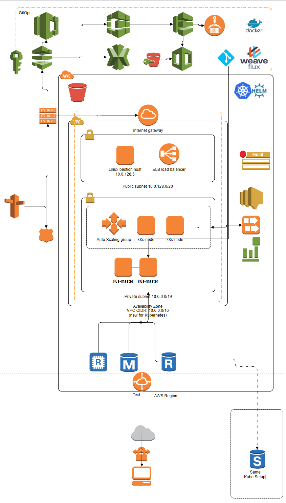
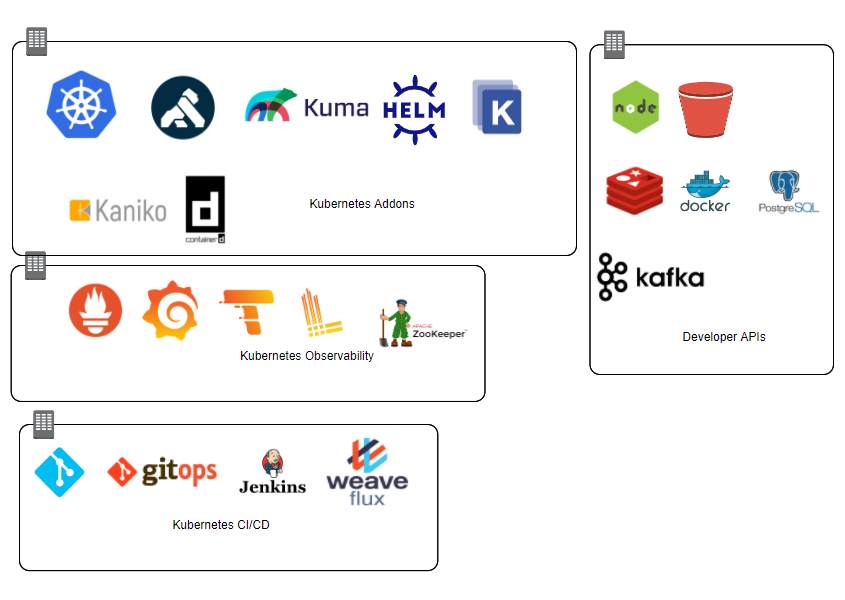

## Developer Solution

Applications are written in Node 14.17.1. With Postgres, Kafka, GRPC, Redis and Swagger.

There is an overall build script, in `./build_and_push.sh`, run this in bash terminal.  This script will run a docker build in the `adidas`, `subscription` and `email` sub-folders.  Each microservice will build the individual Dockerfiles that are in the sub-folders and then publish to docker hub in my profile: `https://hub.docker.com/u/ruairispain`. The script has some more bash code that allows developers to use SemVer to bump the Docker image version number.  This will give us the advantage of backward compatibility if we need to revert to older images.

### GRPC And Windows Issues!

Note if you are on Windows, GRPC is painful to build/compile.  You need to have the Windows C++ distribution and Python install to build locally.  If you get stuck, try install the dependencies and re-run the build and push script.  I wasted many hours debugging this steps locally, apologise if you have the same experience.


#### Dependencies for Build on Windows

Installing the MS Build tools for C++ and adding Python can take a long time, get a coffee! This needs to run in a DOS terminal in elevated Administrator mode.  Also, I needed to downgrade to NPM version 6 for the GYP dependencies to compile correctly.
```
npm install --g --production windows-build-tools
npm config set msbuild_path "C:/Program Files (x86)/Microsoft Visual Studio/2019/Community/MSBuild/Current/Bin/MSBuild.exe"
npm install npm@6 -g

npm ci
npm run start:dev

```


### Microservices

#### 1. API Microservice - `app/adidas`

This is a NestJS microservice, with a REST API and Swagger documentation.  When the endpoints are hit, the API service layer make GRPC client requests to the `Subscription Service` microservice.  Note, the Subscription service should be running to get all the responses running correctly.

To start outside of Docker/Kubernetes, run from the VSCode `JavaScript Debug Terminal`:

```
> cd adidas
> npm run start:dev

```
To see the Swagger documentation, visit: `http://localhost:3000/swagger`.  For testing purposes the API_KEY is shown in the Swagger documentation to make it easier to gain access to the secure API.  When this get as minor revision, this will be put in and environment variable and added to a Kubernetes Secret.  For testing, you can use API_KEY of `1ab2c3d4e5f61ab2c3d4e5f6`

The implementation of the API is defined in `adidas/src/app.controller.ts` and the Swagger header attributes are defined in `adidas/src/main.ts`.  FYI, NestJS is a simple wrapper around Express (of Fastify) with the advantage of typescript decorators to inject functionality at the class and method levels.

Note: NestJs has a number of addons that help speed up the development process.  On the downside, I understand your organisation is focused on performance and HTTP throughput, so MAYBE this is not the *right* choice for your developers.  I wrote the Subscription microservices in plain vanilla nodeJS and Express as well, but I did not like the overall complexity.

Security-wise this is a simple Express application with Morgan, Helmet and compression turned on in the middleware.  Once deployed to Kubernetes it is assumed that this would sit behind a load balancer like Kong and the load balancer would deal with TLS/SSL handshaking and encryption.  For testing locally, there is no SSL secure connection.


#### 2. Subscription Microservice - `app/subscription`

This is a NestJS microservice, with with a GRPC service listening for remote calls.  The Protobuf interface is defined in `subscription/src/models/subscription.proto`.  It's a typical CRUD API, nothing fancy.  The implementation of the API is in: `subscription/src/app.controller.ts`

The API calls are then passed to the service class in `subscription/src/services/subscription.service.ts` and are save to the database.  THe database layer uses Postgres with Sequelize ORM, the sequelize models are in `subscription/src/models/subscriptionDao.ts` while the plain-old JavaScript POJO classes are in `subscription/src/models/subscription.ts`.

The subscription service sends a message to Kafka with the message key `send.message` and the message payload is subscription object and the newsletter associated object (newsletter Model is associated to the subscription model using Sequelize.

To start outside of Docker/Kubernetes, run from the VSCode `JavaScript Debug Terminal`:

```
> cd subscription
> npm run start:dev

```

#### 2. Email Microservice - `app/email`

This is a NestJS microservice, that is Kafka consumer.  The Kafka server is setup with only one extra topic `send.email`.  Note, in Docker compose, the `KAFKA_AUTO_CREATE_TOPICS_ENABLE` is disabled, if developers want to add message keys, they need to make a request to the DevOps team.  This will protect the Kafka partitions from becoming imbalanced and have sub-optimal message performance.

The Kafka message format should be similar to:

```
Kafka Topic: `send.email`

export interface IEmailPost {
  subscription: ISubscription;
  newsletter: INewsletter;
}

```
See the consumer service to see how the messages are processed:
`email/src/app.controller.ts`

This send an email from a SMTP server, see the environment variables in ./email/.env to see the configuration of the email server endpoint:

```
# mail
MAIL_HOST=smtp.example.com
MAIL_USER=user@example.com
MAIL_PASSWORD=topsecret
MAIL_FROM=noreply@example.com

```

Note, the email are generated in HTML using handlebars and the raw HTML templates are stored in `./email/src/templates`  So any new tempaltes, means a rebuiold of the email microservice.  Perhaps a version, can save the handlebars templates in a column in the `Newsletter` Postgres table.

## Kubernetes Solution Architecture

This is the basic solution architecture of Subscription application(s).  The diagram leaves out a second or third region to improve HA and redundancy.  Also, recommend Cloud Front CDN to cache any static content needed by the browser to improve network at edge locations.

The diagram illustrates the network and managed services that would interact with the K8s cluster.  The cluster would ideally be managed by EKS, with potential a hybrid cluster in-house with a AWS Direct Connect.




### CI/CD Solution

GitOps for CI/CD Deployment to Kubernetes
These are a list of the software tools recommended for a complete deployment.  For CI/CD pipeline, I recommend with a AWS managed solution as the top part of the diagram illustrates, or if you prefer a kubernetes native solution, the deploy: Jenkins for CI pipelines, Flux for CI (with two or more Git repositories with the Helm/Kustomise templates) and connect Flux to the nodeJS code repositories so it will trigger new deployments when the Helm/Kustomise files are updated by a git push (or PR merge).

### Git and CD Pipelines
For git, use private GitHub organisation or a local GitLab hosted solution.  If using, GitHub might be easier to use Git Action to manage the pipelines and connect all the steps together.  If you prefer Gitlab then use Jenkin as the pipeline manager.

### Container Registry
Since you are using AWS, use ECR for the private container registry.  And setup Weave Flux to monitor for container updates, Flux also connects and monitors the Git repos with the Helm/Kustomize charts.  Use Flagger and Prometheus for monitors and reporting GitOps events.


### Deploy to Kubernetes


This microservice illustrates nodeJS observability, using logs, metrics and traces generated with OpenTelemetry APIs.  For this toy project, it's overkill but if we were to deploy to a Kubernetes cluster it's vital to have full visibility of our service performance, logs and traces.  The OpenTelemetry is configured in: `adidas/src/utils/tracing.ts`, by default I've turned on more instrumentations than are needed in this microservice.  This is just to illustrate my knowledge.

Another aspect of Kubernetes node observability would be to deploy a `Service Mesh`, for simplicity sake Id choose Kong Kuma or Linkerd as they are easier to setup.  The advantage with Kuma is it has nice policies, that are easy to add to the node sidecar proxy.

If I was deploying this to a K8s cluster, I'd use Helm to install Kong for Ingres and Kuma for internal Service Mesh.  I'd configure Kuma to use mutual TLS for encryption between nodes.  Then add Traffic Permissions (to partition the mesh network into backend, frontend, metrics and data-sources.   It would mean adding Kuma Ingres/Egress rules so the different partitions can communicates through the mesh firewall.  Other Kuma policies I'd add include: Health Checks, Traffic Metrics, Traffic Trace, Traffic Log which would all feed into Prometheus, Grafana, Loki and Traces.  The Circuit Break to back-off and/or disable a microservice if it is misbehaving.  External Services so the Mesh can communicate with outside data sources, like AWS DynamoDB, RDS, S3 etc.  And finally hook-up the Kuma-Kong Gateway so the internet traffic can ingres from Kong gateway to the Kuma Mesa and to the frontend partition.




## Review & Learning Result

In the end, I didn't get the project working.  I lost time on gyp build issues on my Windows desktop and wasn't able to track down why the Docker compose network is not giving me access to the Postgres database.

I would like to have spent more time writing unit and e2e tests but I focused on the code instead.  Also, would have liked to implemented the Github Actions to setup the pipeline steps to build the 3 microservices, triggered to run on a PR acceptance.  The end result would be a publish to Docker Hub and ideal a local MiniKube cluster with Weave Flux and GitOps workflow for deployment.  Sadly, these DevOps tasks takes more time than the time it takes to write the app.

I migrated the compose file to Helm charts used `Kompose`.  Given more time, I would have extracted variables/secrets and then created a `Kustomize` project, with YAML patches for Testing, Staging and Production environments.